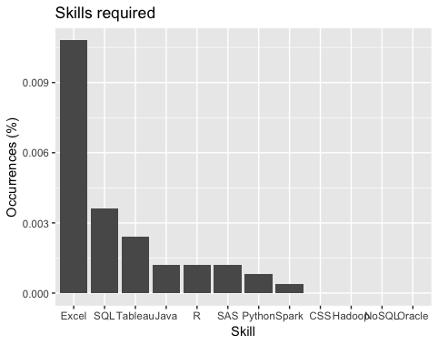

Data Science Jobs in Current Market
========================
author: R project by Gyaan GM
date: August 29, 2018
autosize: true

Dataset summary:
=======================
<small>
As a part of data set, instead of using already available offline data, I have tried to gather live or most recent data on recend data science (DS) jobs in Ontario, Canada from www.indeed.ca. This data is then explored and analyzed in order to determine the relationship between a set of variables. In particlular, the reason for choosing this data is to try to answer the following questions as an aspiring DS professional:

```
Q1. Location wise job listings ?
Q2. What are top six companies with most jobs in data science ?
Q3. Analyst vs Scientist jobs
Q4. What is the most commonly used word in job postings ?
Q5. Most popular skillsets required for DS job ?
```
</small>

Code snippets to output extracts:
=====================================
```
Q1. Location wise job listings ?
```


Code snippets to output extracts contd:
=====================================
```
Q2. What are top six companies with most jobs in data science ?
```


Code snippets to output extracts contd:
=====================================
```
Q3. Analyst vs Scientist jobs
```


Code snippets to output extracts contd:
=====================================

```
Q4. What is the most commonly used word in job postings ?
```


Code snippets to output extracts contd:
=====================================

```

Q5. Most popular skillsets required for DS job ?
```



Conclusion:
===========
<small>
Most of DS jobs are available in Toronto as compared to other cities of Ontario province. TD bank leads the company with highest number of job postings in DS. Most skills required by employers in DS is MS Excel followed by SQL and so on. Moreover, when comparing Data Analyst jobs with Data Scientist jobs, prior has more jobs in market than the latter.
</small>

Q & A:
===========
<small>

Any questions ?

Please also refer the following link for more details: 
<https://github.com/eGyaan/MetroC_R-Project>

Thanks !!

</small>
